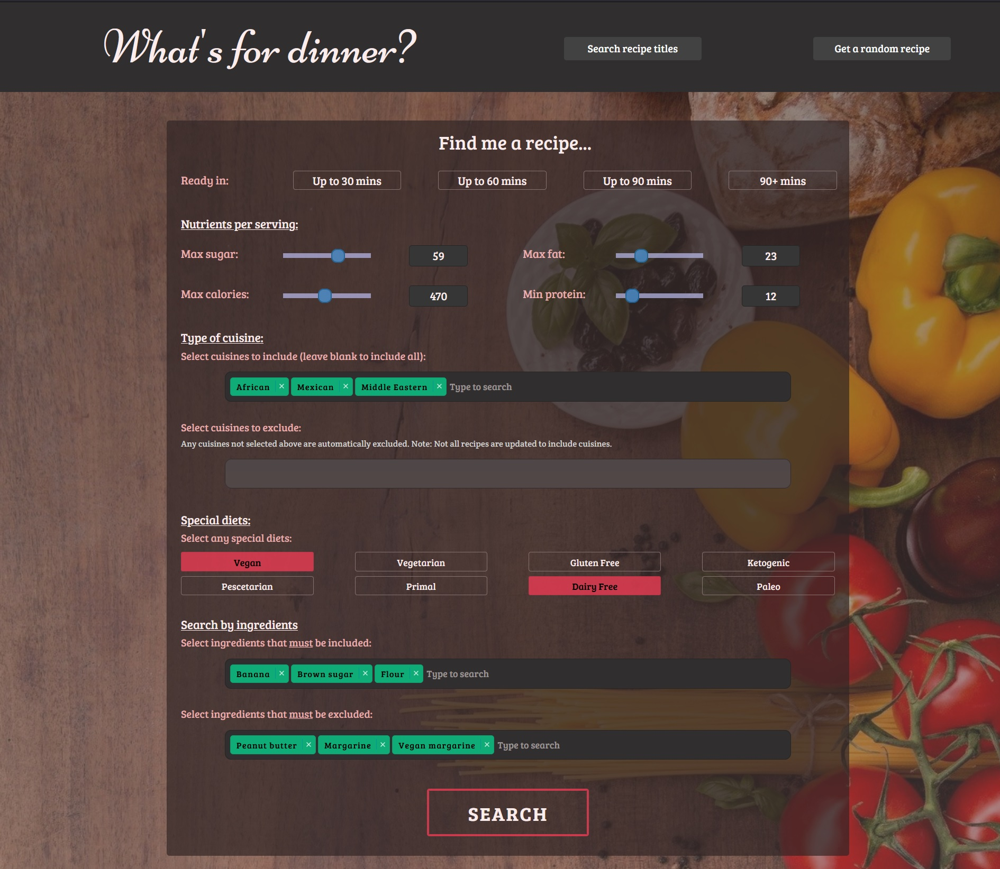
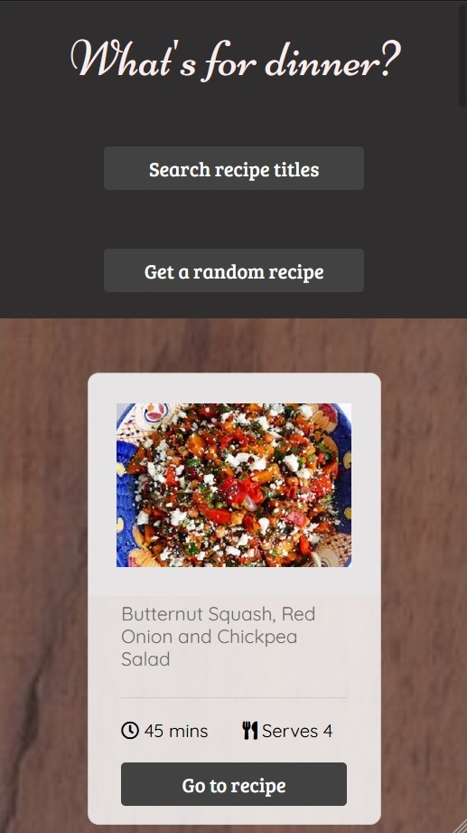
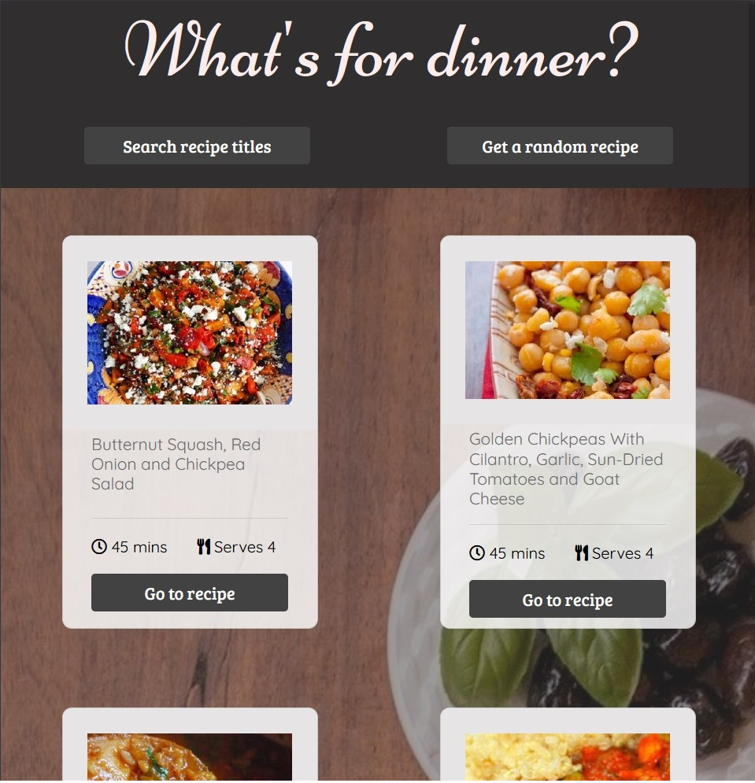
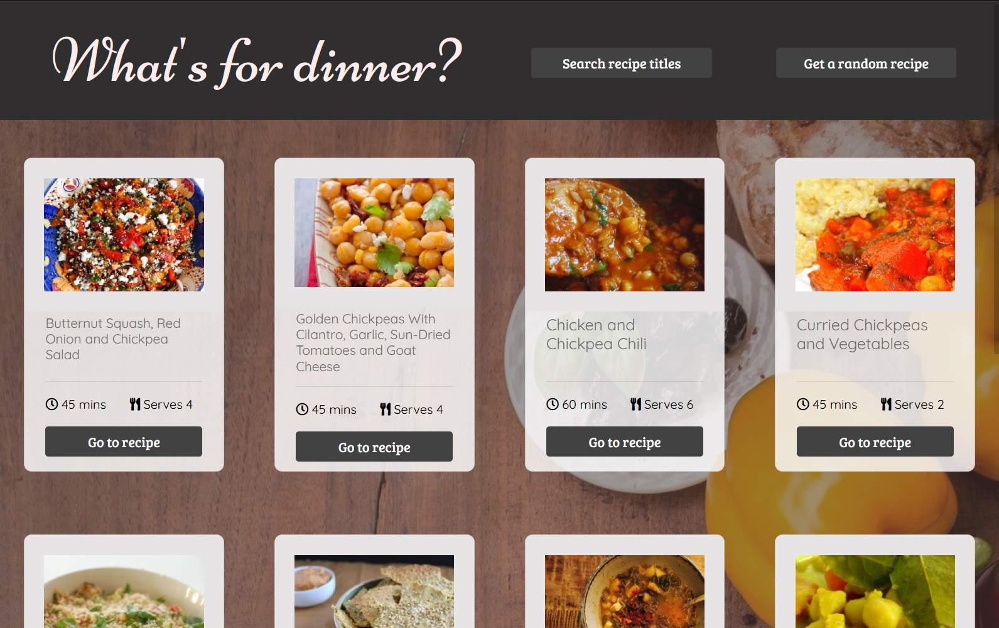

# WhatsForDinner
<!-- TABLE OF CONTENTS -->

  
<h2 style="display: inline-block">Table of Contents</h2>

  <ol>
    <li>
      <a href="#about-the-project">About The Project</a>
      <ul>
        <li><a href="#built-with">Built With</a></li>
      </ul>
    </li>
    <li><a href="#demo-screenshots">Demo & Screenshots</a></li>
    <li><a href="#current-issues">Current Issues</a></li>
    <li><a href="#contributing">Contributing</a></li>
    <li><a href="#license">License</a></li>
  </ol>

<!-- ABOUT THE PROJECT -->
## About The Project

[![Product Name Screen Shot]](https://example.com)

What’s For Dinner uses the Spoonacular API (https://spoonacular.com/food-api) to search for recipes using various search parameters including macronutrients, diets, prep/cook time, cuisines and specific ingredients. It is also possible to search for recipes directly using keywords in the title, and to generate random recipes.
Due to some issues with the Spoonacular API, What’s For Dinner is more proof of concept than a tool for reliable recipe searching.

### Built With

* HTML5
* CSS
* JavaScript
* [jQuery](https://jquery.com/) - a JavaScript library designed to simplify HTML DOM tree traversal and manipulation, as well as event handling, CSS animation, and Ajax.
* [Bootstrap](https://getbootstrap.com/) - the world’s most popular front-end open source toolkit, featuring Sass variables and mixins, responsive grid system, extensive prebuilt components, and powerful JavaScript plugins. 
* [Choices JS](https://github.com/jshjohnson/Choices) - A vanilla, lightweight, configurable select box/text input plugin.

## Demo & Screenshots

  

What’s For Dinner can be viewed from any screen size : 

  

<!--  CURRENT ISSUES -->
## Current Issues
There are several known issues related to the accuracy and consistency of the Spoonacular API data. The 3 examples given below are not bugs I can fix, they are not related to What's For Dinner, but to the Spoonacular API.

* Many Spoonacular recipes do not have cuisines included, which makes the “Search by cuisine” feature a little unreliable.

* Despite the API listing a set number of [diet types](https://spoonacular.com/food-api/docs#Diets), a search produces other “hidden” diet types that cannot be found in the Spoonacular API documentation. For example:
  - “Dairy free” is not listed as a diet type, but is present in many searches
  - “Paleo” is listed as a diet type, but hasn’t been present in any search so far, while “Paleolithic” is not listed as a diet type, but has been present in several searches

* There are multiple issues with the “include ingredients” feature – any ingredients selected must be included in the recipe for it to show up (unlike a “What’s in my fridge” style recipe search). Sometimes a search using 2 ingredients known to be in a Spoonacular recipe will produce no results. For example:
  - A “search recipes by title” search for Raspberry produces a recipe "[Strawberry-Raspberry Cobbler](https://spoonacular.com/strawberry-raspberry-cobbler-661930)", but an “include ingredients” search of Strawberries and Raspberries produces no results at all. My theory is that the ingredients for this recipe ask for “fresh strawberries” and “fresh raspberries” and that is why the API is not matching “strawberries” or “raspberries” to this recipe.
  - There are many other examples like the one above; the include ingredients feature is not well supported by the Spoonacular API.

<!-- CONTRIBUTING -->
## Contributing

If you find a bug, please open an issue [here](https://github.com/AmyMaule/WhatsForDinner/issues/new), including as much information as you can. 
You can request new features or modify current features [here](https://github.com/AmyMaule/WhatsForDinner/issues/new) - please include search queries and expected results.

<!-- LICENSE -->
## License

MIT © Amy Maule
